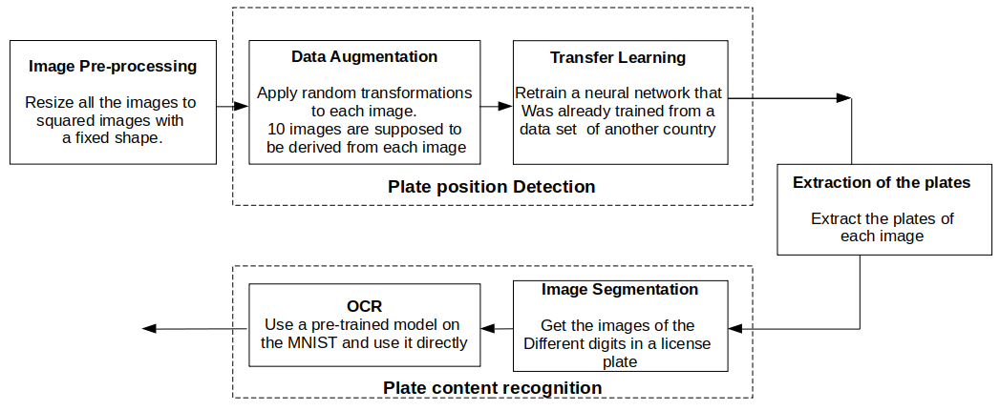

    
 
# Vehicule's License Plate Detection    

 

 ## Table of contents

- [Description](#description)
- [What's included](#whats-included)
- [Creators](#creators)
- [Copyright and license](#copyright-and-license)
 
## Description   

Vehicle License plate detection and recognition is a well-known challenge that has been tackled by many computer-vision labs and companies. However, each country has its own specific license plate formats. This challenge is targeting regular Tunisian license plates. The data provided for this challenge is composed of two datasets:
A set of vehicle images (900 images) taken from the internet and annotated manually. The annotations are the coordinates of the bounding box containing the license plate.
A set of license plate images (900 images) where the annotations are the text written in the license plate.

## What's included

1. Exploratory Data Analysis
    

2. Licence-Plate-Detection
    

## Creators
**Hafsa Bousbiat** [contact](https://github.com/BHafsa)

**Chihab Fortas** [contact](https://github.com/ChihabFortas)

**Salah Abla** [contact](https://github.com/AblaSalah)

**Amine Belgaid** [contact](https://github.com/MineBelgaid)

## Copyright and license

Code released under the [MIT License](https://github.com/BHafsa/Licence-Plate-Detection/blob/main/LICENSE). 
